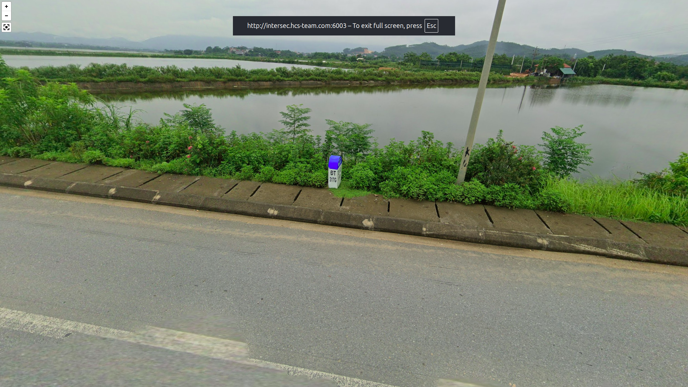
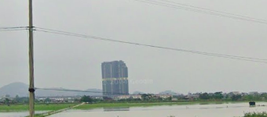
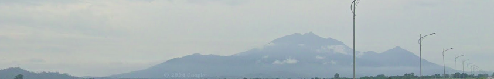
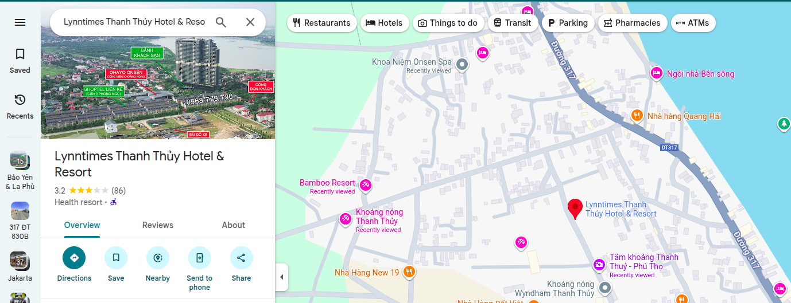
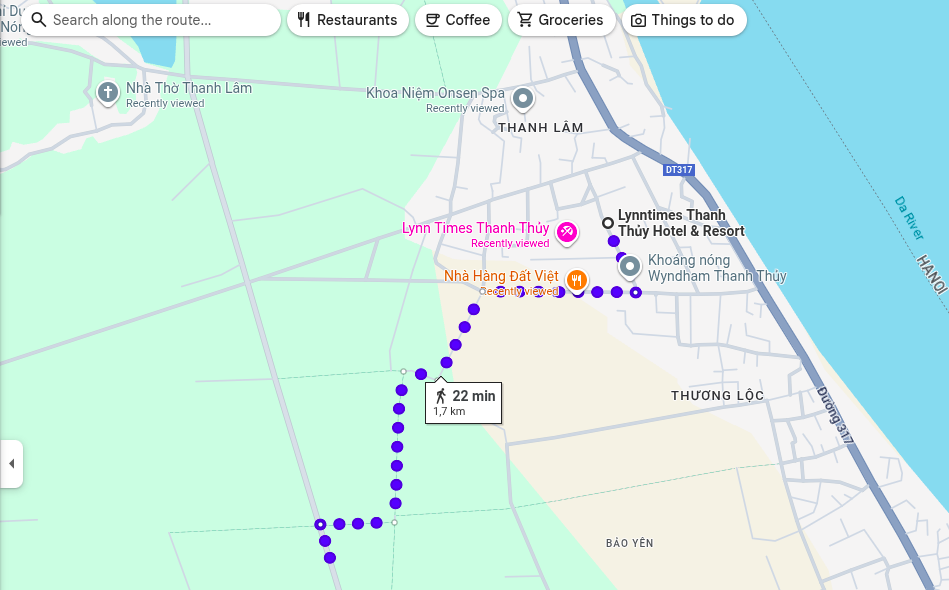
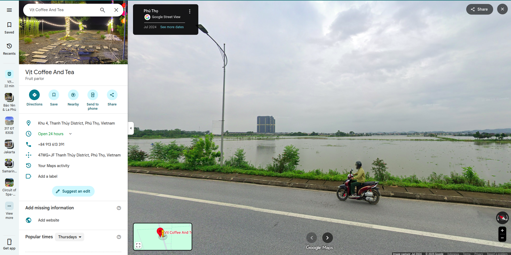
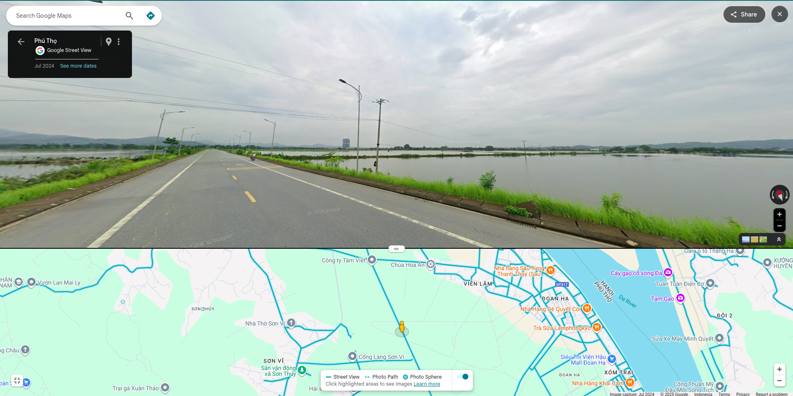

# guessr 3

Author: takanami

Category: OSINT

Flag: ``

## Description

diajak temen ke sini, katanya selesai direnov. tempat apa yh kira2?

format: HCS{current_location_fullname_city}

example: HCS{taman_harmoni_surabaya}

## Solution

Ada beberapa petunjuk yang saya gunakan dalam mencari lokasinya

Dari gambar pertama ada tulisan ĐT 317 yang ketika dicari itu ada di Vietnam

ini petunjuk kedua yang saya gunakan yaitu ada bangunan tinggi

ini pentunjuk ketiga yang saya gunakan yaitu gunung

saya mulai mencari tiga gambar ini berada di mana

gambar pertama dan gambar kedua digabungin (karena udah tau di vietnam)

lalu karena dari gambar kedua itu saya melihat dari sisi kiri bawah dan jauh

selanjutnya karena udah makin menjauh berarti tinggal dimundurin aja

yup ketemu lokasinya