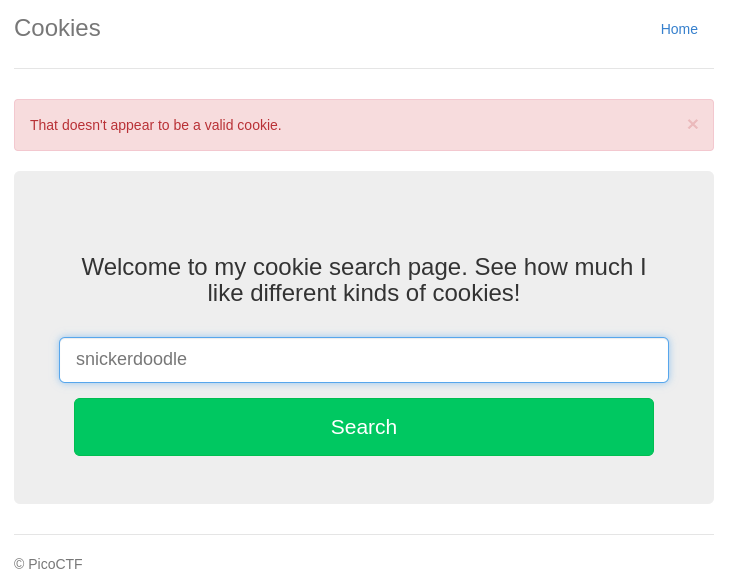
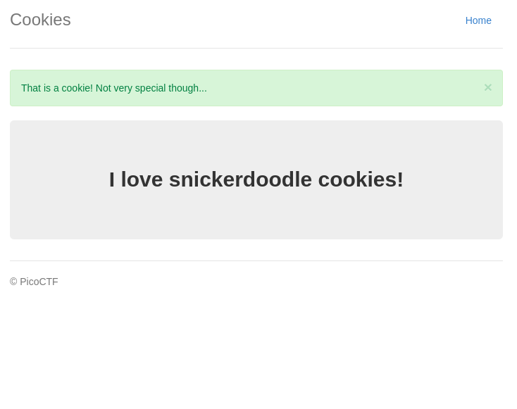
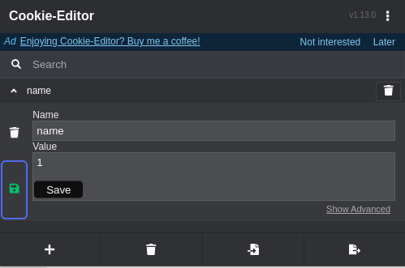
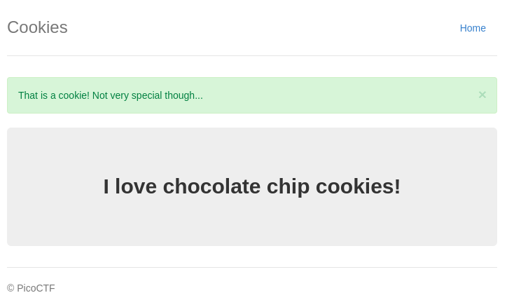
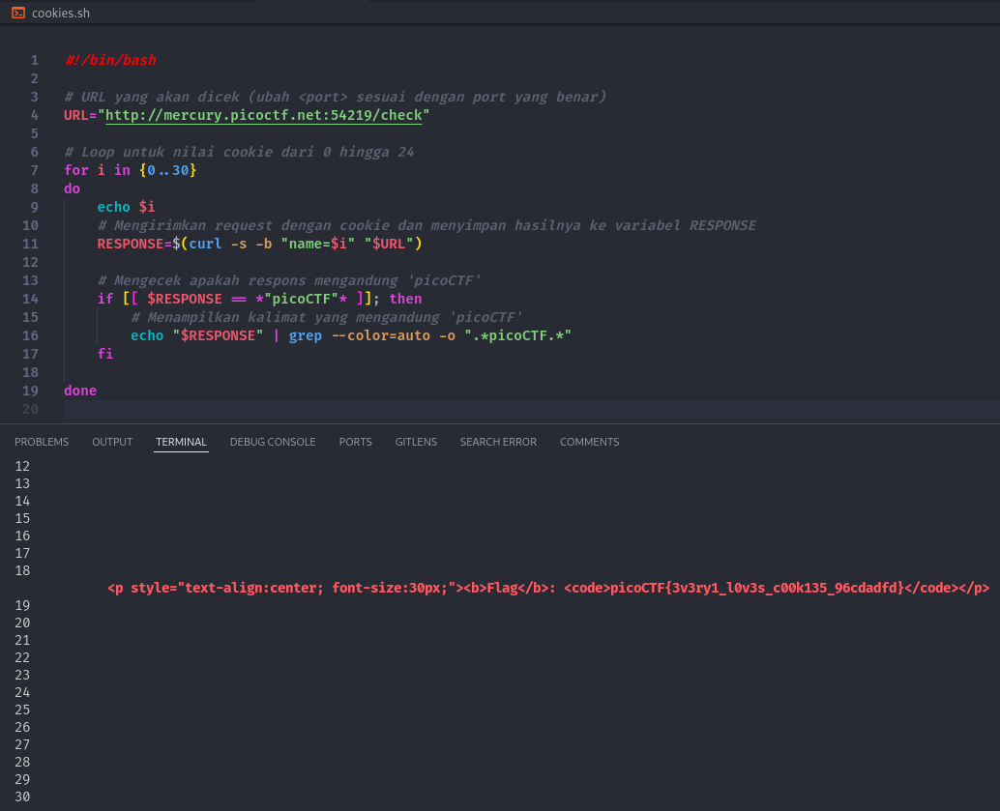

# Cookies

Author: madStacks

Category: Web Exploitation

Flag: `picoCTF{3v3ry1_l0v3s_c00k135_96cdadfd}`

## Description

Who doesn't love cookies? Try to figure out the best one. http://mercury.picoctf.net:54219/

## Difficulty

Easy

## Solution

1. Visit the website

2. Input `snickerdoodle`

3. Check the cookies

4. Tha value is increased from -1 to 0

5. I tried to modify the value

6. and then it worked after I refreshed

7. So I made a script for automation

8. Boom, I got the flag
