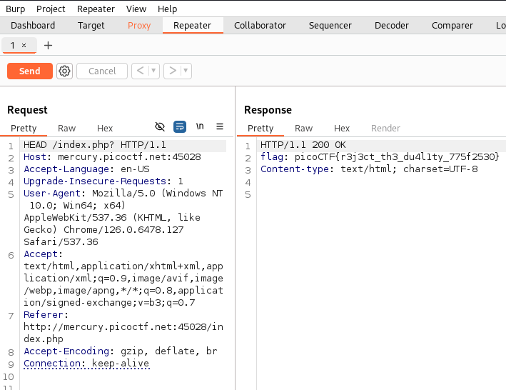

# GET aHEAD

Author: madStacks

Category: Web Exploitation

Flag: `picoCTF{r3j3ct_th3_du4l1ty_775f2530}`

## Description

Find the flag being held on this server to get ahead of the competition http://mercury.picoctf.net:45028/

## Difficulty

Easy

## Solution

1. Actually the title of problem gave us a hint

2. Just open your burpsuite and then intercept every request (two choises)

3. I saw the different from each request is HEAD and POST

4. So, I curious about it.

5. Open your browser and I typed HEAD GET POST

6. There's a good article that I found `https://developer.mozilla.org/en-US/docs/Web/HTTP/Methods`

7. Intercept the request and send to repeater

8. Modify the http request to HEAD and send

