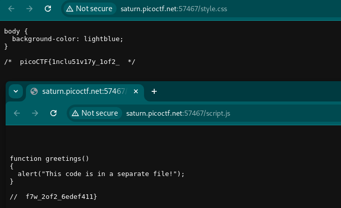

# Includes

Author: LT 'syreal' Jones

Category: Web Exploitation

Flag: `picoCTF{1nclu51v17y_1of2_f7w_2of2_6edef411}`

## Description

Can you get the flag?
Go to this website and see what you can discover.

## Difficulty

Easy

## Solution

1. Visit the website and then try to gather information

2. When I tapped the button, I get a message like: `This code is in a separate file!`

3. Open the css and js file

4. in css file, I got `picoCTF{1nclu51v17y_1of2_`

5. in js file, I got `f7w_2of2_6edef411}`

6. Just combined it
