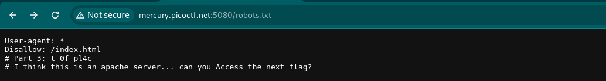

#

Author:Scavenger Hunt

Category: Web Exploitation

Flag: ``

## Description

There is some interesting information hidden around this site http://mercury.picoctf.net:5080/. Can you find it?

## Difficulty

Easy

## Solution

1. Visit the website and then see the source code

2. I got part of flag `picoCTF{t `

3. and then I opened the css file, I got `Here's part 2: h4ts_4_l0`

4. I opened the js file, I found a question `How can I keep Google from indexing my website?`

5. Use my browser to find what it neans

6. and then I think just write down robots.txt after the url website, it'll become: `http://mercury.picoctf.net:5080/robots.txt`

7. I got another part of flag: `t_0f_pl4c`

8. and then I found a question again `I think this is an apache server... can you Access the next flag?` the answer is .htaccess

9. and then I think just write down .htaccess after the url website, it'll become: `http://mercury.picoctf.net:5080/.htaccess`

10. I got another part of flag `3s_2_lO0k` and I found a question `I love making websites on my Mac, I can Store a lot of information there.`

11. The answer is `.DS_Store`

12. Just write down `http://mercury.picoctf.net:5080/.DS_Store`

13. I found the last flag `Congrats! You completed the scavenger hunt. Part 5: _35844447}`

14. Or you can use tool for directory scanning

`$dirsearch -u http://mercury.picoctf.net:5080/`

15. Just combined it

