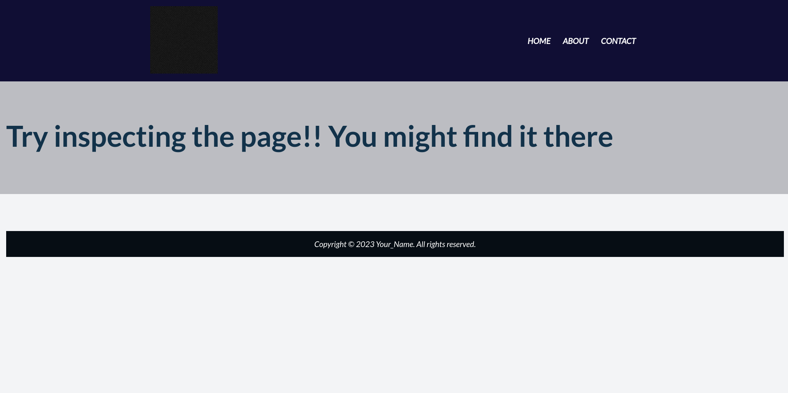
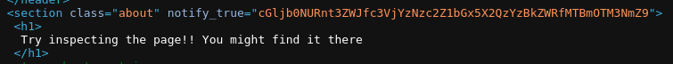

# WebDecode

Author: Nana Ama Atombo-Sackey

Category: Web Exploitation

Flag: `picoCTF{web_succ3ssfully_d3c0ded_10f9376f}`

## Description

Do you know how to use the web inspector?
Start searching here to find the flag

## Difficulty

Easy

## Solution

1. Cek semua navbar/tombol navigasi yang ada

2. Setelah itu di about muncul halaman yang sepertinya berisi petunjuk/perintah untuk coba inspect halaman website tersebut

3. Dari source code ada yang menarik perhatian saya, yaitu string yang lumayan panjang

4. Saya coba copy string tersebut dan saya coba decode menggunakan base64

5. Lalu hasilnya `picoCTF{web_succ3ssfully_d3c0ded_10f9376f}`
