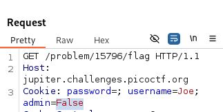
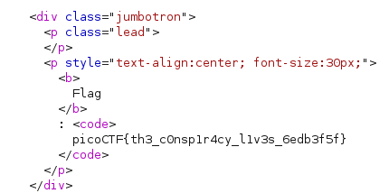

# logon

Author: bobson

Category: Web Exploitation

Flag: `picoCTF{th3_consp1r4cy_l1v3s_6edb3f5f}`

## Description

The factory is hiding things from all of its users. Can you login as Joe and find what they've been looking at? https://jupiter.challenges.picoctf.org/problem/15796/ (link) or http://jupiter.challenges.picoctf.org:15796

## Difficulty

Easy

## Solution

1. Go to website and just fill `Joe` for username and you can leave it for the password

2. Before submit it, open your Burp Suite and intercept all request (there are 4 requests)

3. Your fourth request will display it

4. Change the value of admin from False to True

5. Then you get the flag

