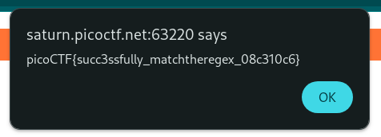

# MatchTheRegex

Author: Sunday Jacob Nwanyim

Category: Web Exploitation

Flag: `picoCTF{succ3ssfully_matchtheregex_08c310c6}`

## Description

How about trying to match a regular expression
The website is running here.

## Difficulty

Medium

## Solution

1. Visit the website

2. Check the source code

3. You'll find `// ^p.....F!?`

4. Cause in the description said `trying to match a regular expression'

5. I thought the website will try to match from user input to their regex

6. So just type picoCTF

7. Then the you'll get the flag

