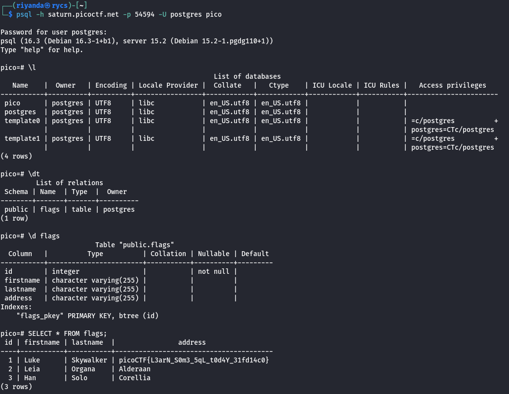

# SQL Direct

Author: Mubarak Mikail / LT 'syreal' Jones

Category: Web Exploitation

Flag: `picoCTF{L3arN_S0m3_5qL_t0d4Y_31fd14c0}`

## Description

Connect to this PostgreSQL server and find the flag!
psql -h saturn.picoctf.net -p 54594 -U postgres pico
Password is postgres

## Difficulty

Medium

## Solution

1. First you need a knowledge about database

2.As I know, database workflow, such as selecting a database, table, and column.

3.  \l -> list all databases on the PostgreSQL server, showing details such as the database name, owner, encoding, and access privileges.

4.  \dt -> lists the tables in the currently active schema

5.  \d flags -> Provides detailed information about a specific table, view, or sequence named flags. It shows columns, their types, modifiers, and indexes

6.  SELECT \* FROM flags; -> it will return every column and every row of data stored in the flags table.

