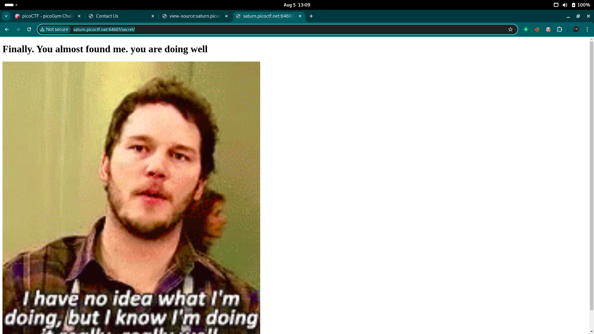
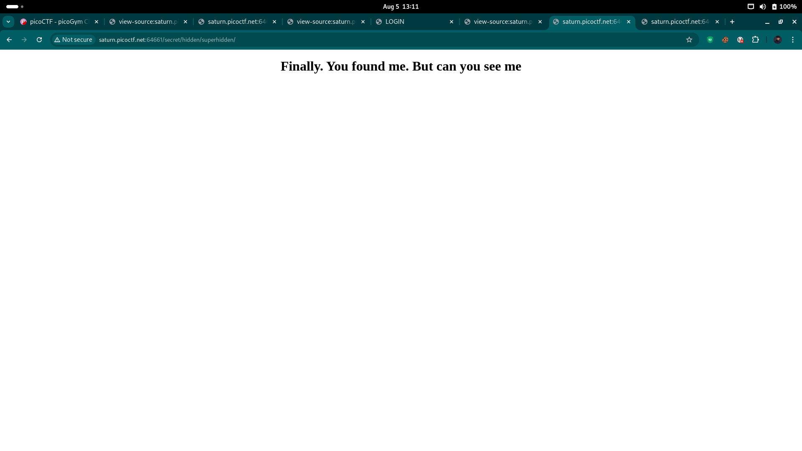
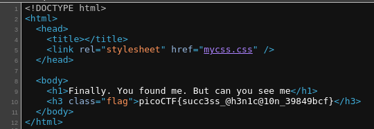

# Secrets

Author: Geoffrey Njogu

Category: Web Exploitation

Flag: `picoCTF{succ3ss_@h3n1c@10n_39849bcf}`

## Description

We have several pages hidden. Can you find the one with the flag?
The website is running here.

## Difficulty

Medium

## Solution

1. Visit the website

2. Check the source code

3. You'll find `<link href="secret/assets/index.css" rel="stylesheet" />`

4. Just click it and remove `assets/index.css`, so the url looks like `http://saturn.picoctf.net:64661/secret/`

5. Check the source code again

6. You'll see `<link rel="stylesheet" href="hidden/file.css" />`

7. Just click it and remove `file.css`, the url will become `http://saturn.picoctf.net:64661/secret/hidden/`

8. Check the source code again

9. You'll find `<link href="superhidden/login.css" rel="stylesheet" />`

10. Just click it and remove `login.css`, the url will become `http://saturn.picoctf.net:64661/secret/hidden/superhidden/`

11. Check the source code and you'll see the flag

