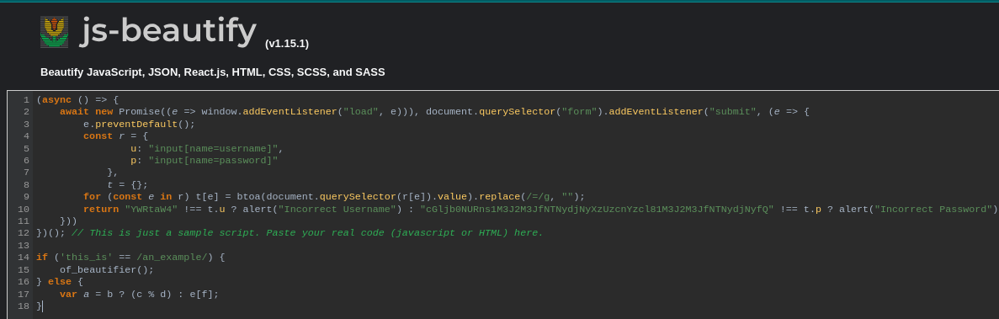
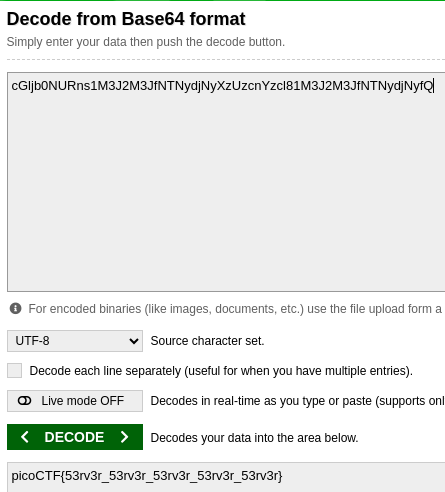

# login

Author: BrownieInMotion

Category: Web Exploitation

Flag: `picoCTF{53rv3r_53rv3r_53rv3r_53rv3r_53rv3r}`

## Description

My dog-sitter's brother made this website but I can't get in; can you help?
login.mars.picoctf.net

## Difficulty

Medium

## Solution

1. Visit the website

2. Check the source code

3. Open the js file

4. Copy the code and go to `https://beautifier.io/` for easy to see the code

5. Look here `return "YWRtaW4" !== t.u ? alert("Incorrect Username") : "cGljb0NURns1M3J2M3JfNTNydjNyXzUzcnYzcl81M3J2M3JfNTNydjNyfQ" !== t.p ? alert("Incorrect Password") : void alert(`Correct Password! Your flag is ${atob(t.p)}.`)`

6. Look at the `atob` function which is base64 decode `Your flag is ${atob(t.p)}`

7. Copy `cGljb0NURns1M3J2M3JfNTNydjNyXzUzcnYzcl81M3J2M3JfNTNydjNyfQ` and go to `https://www.base64decode.org/`

8. You'll see the flag

